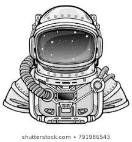

<!doctype html>
<html>	
<head>
<meta charset="UTF-8">
<title>Devin's Website Layout</title>

	
	
	
	
	
</head>
<h1>Digi~Dev</h1>
YOOOOOOOOOO! You just landed on my page....That means your either in to the the glitz and glamour of the entertainment world or Day tradeing.These are obvioiosly intrest of mine and id like to take you into my world. Pick a path that intrest you. 
	
	
<h3>Sweet Southern Burlesque~~~~Space Camp Pips</h3>

	
	
	
	
	
	
	
	

<h5>Follow Me On</h5>
	
	~~~~~~~~~~~~~~~~~~~~~~~~~~~~~~~~~~~~~~~~~~~~~~~~~~~~~~~~~~~~~~~~~~~~~~~~~~~~~~~~~~~~~~~~~~~~~
	
	~~~~~~~~~~~~~~~~~~~~~~~~~~~~~~~~~~~~~~~~~~~~~~~~~~~~~~~~~~~~~~~~~~~~~~~~~~~~
	
	
	 
	 
	 
	 
	 
	<ul>
		notes
	<li>Project 1</li>
	<li>Project 2</li>
	<li>Project 3</li>
	<ol>
	<li>Part 1</li>
	<li>Part 2</li>
	<li>Part 3</li>
		
		
	  Use BR to break a sentacne in half.   <em>Use command em to slant words</em>   <b>To make bold simple use b </b> 
	</ol>
	</ul>
<body>
</body>
</html>
